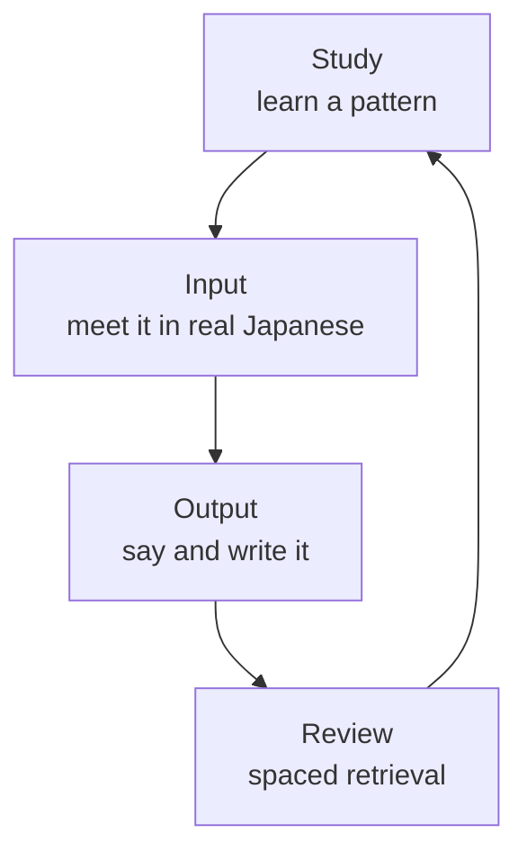

# Study and Immersion: The Middle Path

Two kinds of learner turn up in every Japanese class. The first has finished both Genki textbooks, can recite every form of 食べる and freezes when a shop assistant asks 袋はご利用ですか (*Fukuro wa goriyō desu ka*, "Would you like a bag?") at normal speed. The second has watched anime for ten years, understands half of every episode, and has never managed to say a full sentence out loud, because nobody ever asked for one. Each method fails in its own way, and each fixes the other's failure. The research on how adults learn languages points not to a side but to a combination, and this book is built on it.

## What Each Side Gets Right

The case for immersion rests on **comprehensible input**: language you hear or read and mostly understand, with a little that stretches you. The linguist Stephen Krashen argued in *Principles and Practice in Second Language Acquisition* (1982) that people acquire a language mainly by understanding messages in it, not by studying rules. Decades of research broadly support the core of that claim. Nobody becomes fluent without thousands of hours of understood input, and input you don't understand, such as a late-night Japanese talk show in your second week, teaches you almost nothing.

The case for study is that input alone is slow and leaves gaps. The best-known evidence comes from Canadian French immersion schools, where English-speaking children took their classes in French for years. Merrill Swain (1985) found that they understood French almost like native speakers but still made basic grammar errors when they spoke and wrote. A large review of classroom research by John Norris and Lourdes Ortega (2000) found that explicit instruction, being taught a rule and practicing it, produces substantial and lasting gains. An adult can read in five minutes that は marks the topic and が the subject, a distinction that might take hundreds of hours of listening to work out unaided (and still needs those hours to feel natural).

The third ingredient is **output**: speaking and writing. Swain argued that producing language forces you to notice what you can't yet say, which input lets you skip; Richard Schmidt (1990) argued that you learn what you notice. Talking with people adds feedback, the puzzled look or the gentle recast that shows you where the message broke down (Long, 1996). The anime fan in the opening paragraph has plenty of input and almost no output, which is why their Japanese stays locked inside their head.

## The Learning Loop

The middle path is a cycle, the **learning loop**: study a structure, meet it in real Japanese, use it yourself, and review it so it stays. Every chapter of this book runs the loop, pairing a structure with real input and a task to try on a person.

*Figure: Study, input, output and review feed each other, and skipping any one of them slows the whole loop.*

One turn of the loop might look like this. You learn the phrase 〜に行きたいです (*… ni ikitai desu*, I want to go to …) in [section 4.3](../04-building-sentences/03-phrases-and-idioms.md), and with it the pattern behind it: 〜たい (*-tai*) turns a verb into "want to", so 食べる becomes 食べたい (*tabetai*, I want to eat). That evening, in a ten-minute travel vlog, you catch it three times. The next day you tell a tutor, or your phone's voice recorder, where you want to go this year:

> 今年は京都に**行きたい**です。\
> *Kotoshi wa kyōto ni ikitai desu.*\
> This year I want to go to Kyoto.

The sentence you stumbled on goes into your flashcards. A week later, 〜たい is no longer a rule; it is how you talk.

## Spaced Repetition and Retrieval Practice

Memory fades on a predictable curve, as Hermann Ebbinghaus showed in 1885 by memorizing nonsense syllables and testing himself: most of what you learn today is gone within days unless you meet it again. Two findings from memory research turn that curve to your advantage.

The first is the spacing effect. Reviews spread out over time produce far more durable memory than the same reviews crammed together; a large meta-analysis by Nicholas Cepeda and colleagues (2006) confirmed it across hundreds of experiments. **Spaced repetition** is a review method built on it: each item comes back just before you are likely to forget it, at growing intervals of a day, then a few days, a week, a month. Items you know fade into the background; items you keep missing come back often.

The second is the testing effect. Pulling an answer out of memory strengthens it more than rereading it. In a study by Jeffrey Karpicke and Henry Roediger (2008), students who repeatedly tested themselves on foreign-language word pairs recalled about 80% of them a week later; students who kept restudying the pairs instead recalled about 36%. **Retrieval practice**, recalling before you look, is why flashcards work, and why rereading your notes mostly doesn't.

A spaced repetition system such as Anki or WaniKani combines the two: it schedules the reviews and makes every review a retrieval. [Section 3.4](../03-writing-system/04-studying-kanji.md) shows how to set both up for kanji. Four habits make them far more effective for Japanese:

- **Learn words in sentences.** A card with 会う (あう, *au*, to meet) alone teaches less than one with a sentence you understood in real Japanese, because the sentence shows the grammar. You meet *with* someone in Japanese, so the person takes に (*ni*) or と (*to*) and never を: 友達**に**会う (*tomodachi ni au*), never \*友達を会う.
- **Put audio on every card,** and say the answer aloud before you flip. A card that only tests meaning trains your eyes and leaves your ears and mouth behind, and audio is the only way a card can teach vowel length and pitch.
- **Test the hard direction too.** Recognizing 約束 (やくそく, *yakusoku*) as "promise" is easier than producing *yakusoku* when you want to say "promise". Add production cards, English to Japanese, for the words you want to use.
- **Cap your new cards.** The most common way spaced repetition fails is adding too many. Every new card returns for weeks, so fifty new cards today means hundreds of reviews next week.

> **Warning:** Ten to twenty new cards a day is plenty for most learners, counting kanji and vocabulary together. A deck you review every day beats a bigger one you abandon, and the learner who adds 15 cards a day for a year knows more words than the one who added 60 a day for a month and quit.

## Comprehensible Input and Its Limits

Input is the engine; most of your hours should go there once you are past the first weeks. The trick is keeping it comprehensible. For a beginner that means content made for learners: slow, clear videos about everyday life, graded readers, podcasts with transcripts, all described in [section 1.3](03-apps-courses-and-tools.md). As you improve, move to native content you already know the shape of: a children's anime, a drama you've seen with subtitles, a game you've played in English. [Chapter 12](../12-japanese-for-media/README.md) maps the road through anime, manga and the news.

Input has two limits worth knowing. The first is Swain's: understanding does not automatically produce accurate speech, so you need output and some study alongside. The second is specific to Japanese: the features that change meaning without changing spelling much, vowel length, double consonants and pitch, are easy to ignore while understanding, because context usually fills the gap. Many learners with excellent comprehension still say *obasan* when they mean *obāsan*. The fix is to train perception directly, and to learn every word with its sound from the start.

## Training Your Ear

The best-supported method for hearing a difficult contrast is **high-variability phonetic training** (HVPT): many short rounds of hearing a word and choosing what you heard, with immediate feedback, using recordings from many different speakers. The variety is the point. Hearing one teacher teaches you that teacher; hearing ten voices, male and female, fast and slow, teaches you what all their long vowels have in common. The method was developed in the early 1990s to teach Japanese listeners the English *r* and *l* (Logan, Lively and Pisoni, 1991), and a review by Ron Thomson (2018) found HVPT effective across dozens of studies and languages.

For an English speaker, the classic hard contrast in Japanese runs the other way: length. Japanese counts beats, and a long vowel or a double consonant adds one, so おばさん (*obasan*, aunt) and おばあさん (*obāsan*, grandmother), or きて (*kite*, come) and きって (*kitte*, stamp), are different words. English uses length only loosely, so the English ear files both as the same word. Training helps, though less dramatically than with some contrasts. In a study by Yukari Hirata and Spencer Kelly (2010), 60 English speakers practiced telling short from long vowels in Japanese sentences for four 30-minute sessions over two weeks; learners who trained on audio alone went from 68% to 75% correct, and those who could also watch the speaker's mouth went from 64% to 78%. Keiichi Tajima and colleagues (2008) trained listeners on isolated words and found no overall gain beyond an untrained group; training helped with the contrasts practiced and carried over to new speakers, but not to faster speech or to untrained kinds of length contrast. The honest summary: perception of length improves with training, the gains in studies so far are modest, and practice with whole sentences at more than one speed transfers best (Hirata, 2004a; Hirata, Whitehurst and Cullings, 2007).

Pitch accent is the second contrast. Tokyo Japanese marks words with a pattern of high and low pitch: 箸 (はし, *hashi*, chopsticks) falls after its first beat, while 橋 (はし, *hashi*, bridge) rises and falls only after the word ends. Irina Shport (2016) trained English speakers to identify pitch patterns with many words, contexts and voices, and their accuracy improved, carrying over to new words; the pattern with no fall at all remained the hardest to hear. Visual pitch displays help as well: in a small study by Hirata (2002), four learners who practiced matching on-screen pitch and length contours for ten 30-minute sessions rose from 52% to about 70% on combined perception and production tests, while four untrained learners, who also started at 52%, rose only to about 57%. A journal version of the study followed (Hirata, 2004b). [Section 2.3](../02-sounds-of-japanese/03-long-vowels-and-double-consonants.md) and [section 2.4](../02-sounds-of-japanese/04-pitch-accent-and-intonation.md) show how to set up both kinds of training. Ten minutes a day for a few weeks, early in your studies, is a cheap investment in every hour of listening that follows.

## Shadowing

**Shadowing** is repeating a recording aloud while it plays, a fraction of a second behind the speaker, copying their rhythm, pitch and intonation as closely as you can. It began as a drill for training simultaneous interpreters, and it became a staple of English teaching in Japan after the applied linguist Shuhei Kadota's popular books on shadowing and reading aloud in the 2000s, including 『シャドーイングと音読の科学』 (*The Science of Shadowing and Reading Aloud*, 2007). In other words, Japanese classrooms have been testing it on learners of English for twenty years, and you can turn it around.

The evidence is encouraging, with limits. Yo Hamada (2016) gave 43 Japanese university students nine shadowing sessions; both lower- and intermediate-level students got better at perceiving English sounds, but only the lower-level group improved on listening comprehension questions. Shadowing seems to work by sharpening bottom-up listening, catching where one word ends and the next begins, which is exactly the skill that fast Japanese demands. For Japanese it has a second benefit: it trains your mouth to hold long vowels and double consonants at speed, inside phrases, where they blur.

Choose a short recording, thirty seconds to a minute, with a transcript and a speaker you like. Listen once with the transcript, shadow it with the transcript, then shadow it without. Five minutes a day does more for your accent than any explanation. Record yourself once a week and compare.

## Extensive Reading and the 98% Rule

**Extensive reading** means reading a lot of easy material for pleasure, fast, without stopping to look up every word; **intensive reading**, slow study of a hard text, is its partner. Research on how much of a text you need to know points to a clear threshold. Batia Laufer (1989) put the minimum for reasonable comprehension at 95% of the words. Marcella Hu and Paul Nation (2000) found that most readers needed about 98% for comfortable, unassisted reading of fiction: one unknown word in fifty. Below that, reading turns into decoding, and decoding is slow, tiring and quickly abandoned.

For Japanese the threshold arrives late, because a native novel assumes about 2,000 kanji and tens of thousands of words. **Graded readers**, books written within a fixed list of words and kanji, are how a learner reaches 98% coverage years earlier. Japanese teachers have built a movement around them: 多読 (*tadoku*, "reading a lot"), led since 2002 by the group now called NPO 多言語多読 (Tadoku Supporters). Its rules for learners are short: start with books so easy you can read them without translating, don't use a dictionary, skip what you don't understand, and drop a book that bores you for another. The group's graded readers run from a starter level of about 200 words to level 5 at about 2,000, and many are free online, as section 1.3 explains.

The research on extensive reading in Japanese specifically is still thin. In a small classroom study by Chikako Hitosugi and Richard Day (2004), 14 second-semester students at the University of Hawaii read Japanese children's books for ten weeks, 31 books each on average, and improved on a comprehension test while a regular class did not; the authors call their results indicative rather than conclusive. Read as much as you can at the level where you know nearly every word, and move up when you stop noticing the effort. [Section 12.2](../12-japanese-for-media/02-manga.md) maps the road from graded readers to manga.

## Kanji Through Components and Words

Kanji reward understanding over rote copying. Most of them are built from a few hundred recurring components, as [section 3.3](../03-writing-system/03-kanji.md) explains, and a component you know is a hook for every kanji that contains it. One experiment makes the point vividly. Flaherty and Noguchi (1998) taught 30 new kanji to 29 English-speaking adults who knew only a few dozen, half by breaking each kanji into components with a short story, half by whole-kanji repetition. On a surprise test one to three weeks after the kanji were taught, the component learners remembered far more: among the learners living in Japan, they recalled the meanings of about 25 of the 30 kanji against about 14 for the rote learners, and they could write about 14 against about 3. The study was small, and a month later the advantage held only for the learners living in Japan, but the direction is consistent with how memory works.

Components are a means, not an end. Heath Rose (2013) followed learners of kanji for a year and found that mnemonic stories helped when they were used to make kanji meaningful, and hurt when learners leaned on them so heavily that they knew a kanji's story but couldn't read it aloud. And words beat isolated kanji: Yoshiko Mori (2003) found that learners guessing the meaning of unfamiliar kanji compounds did best when they used both the kanji in the word and the sentence around it. So learn the common components early, give each new kanji a short story, and learn it inside the words you use: 電 (*den*, electricity) through 電車 (でんしゃ, *densha*, train) and 電話 (でんわ, *denwa*, telephone), not as an isolated square. [Section 3.4](../03-writing-system/04-studying-kanji.md) compares the methods.

> **Tip:** Go do this today. Pick a thirty-second clip of someone speaking Japanese at a comfortable pace, find its transcript, and shadow it five times. Listen for the long vowels and the small pauses of っ you flatten. Do the same clip tomorrow, and you will hear the difference.

## Two Myths to Drop

Two popular beliefs about learning deserve to be retired. The first is learning styles, the idea that you learn best when teaching matches your style, visual, auditory or kinesthetic. Harold Pashler and colleagues (2008) reviewed the research for the Association for Psychological Science and found virtually no evidence that matching instruction to a style improves learning; several well-designed studies contradicted it outright. Everyone learns Japanese through the ears, the eyes and the mouth, because the language lives in all three.

The second is that adults can't learn languages. The research on age says something more precise. In the largest study to date, Joshua Hartshorne, Joshua Tenenbaum and Steven Pinker (2018) analyzed an online grammar quiz taken by about 670,000 people, and found that the ability to learn grammar stays strong until about 17 and then declines steadily; to reach a native speaker's command of grammar, you probably need to start by about 10 to 12. That is a ceiling on native-level perfection, not a barrier to fluency. And adults have advantages too: an early review by Stephen Krashen, Michael Long and Robin Scarcella (1979) concluded that adults progress faster than children in the early stages, helped by the explanations, plans and dictionaries that children can't use. The adult learner's job is to use those advantages, and then to put in the hours of input that children get for free.

## A Daily Routine by Level

The balance shifts as you improve. Beginners need more study, because they can't yet understand much real Japanese, and early ear training and kana pay off for years. Advanced learners need almost all input and output, with study kept for specific gaps. The table below suggests how to divide about 45 minutes a day, plus whatever extra listening you can fit into a commute or a workout. It rests on teachers' and learners' experience, shaped by the research above, rather than on a study of this exact mix. The levels are the JLPT bands described in [section 1.4](04-the-jlpt-map.md).

| Level | Study | Input | Output | Review |
|---|---|---|---|---|
| Beginner (N5–N4) | 15 min of this book or a course; 10 min of length and pitch training in the first two months | 10 min of learner podcasts or a graded reader | 5 min of shadowing; one tutor session a week | 10 min of flashcards, kanji and words |
| Intermediate (N3) | 10 min on grammar gaps and kanji | 20 min of podcasts, YouTube, graded readers, NHK News Web Easy | Two conversations a week; a short journal entry or chat message | 10 min |
| Advanced (N2–N1) | As needed: keigo, written style, idioms | Native media: news, novels, dramas, anything you enjoy | Regular conversations; writing for real readers | 5–10 min, for words you want to keep |

The exact numbers matter less than consistency. Forty-five minutes every day beats five hours on Sunday, because spaced repetition, ear training and listening all depend on frequency. On a bad day, do only your flashcards: the habit survives, and so do the words. [Chapter 14](../14-the-jlpt/README.md) turns this routine into a study plan for each level of the exam.

## Summary

- Comprehensible input is the engine of acquisition, but input alone leaves gaps: explicit study speeds learning, and output and feedback show you what you can't yet say.
- The learning loop runs study, input, output and review, and every chapter of this book pairs a structure with real Japanese and a task to try.
- Spaced repetition and retrieval practice keep vocabulary alive: learn words in sentences with audio, add production cards, and cap new cards at 10 to 20 a day.
- Ear training with many voices improves perception of vowel length, double consonants and pitch accent, though the gains in studies so far are modest; shadowing trains you to hear and say them at speed.
- Extensive reading works at about 98% known words, which for Japanese means graded readers first; learn kanji through components and inside real words.
- Learning styles have no support as a basis for teaching, and adults learn languages well, often faster than children at first; what late starters rarely reach is native-level perfection.

---

<!--nav-->

[← Previous: Why Japanese](01-why-japanese.md) | [Contents](../README.md) | [Next: Apps, Courses and Tools →](03-apps-courses-and-tools.md)

<!--/nav-->
